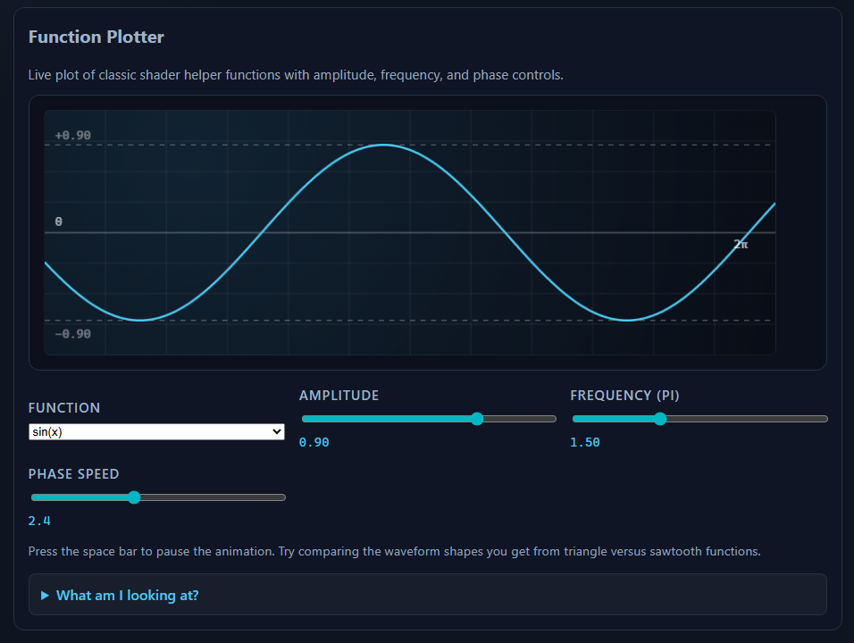
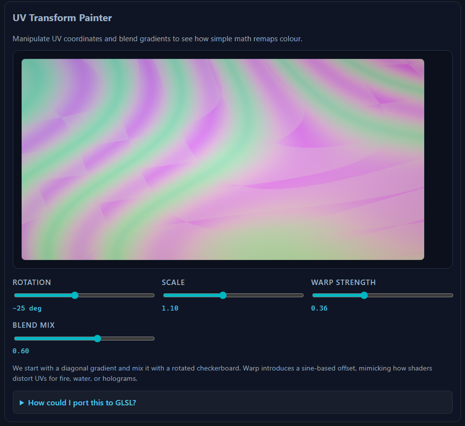
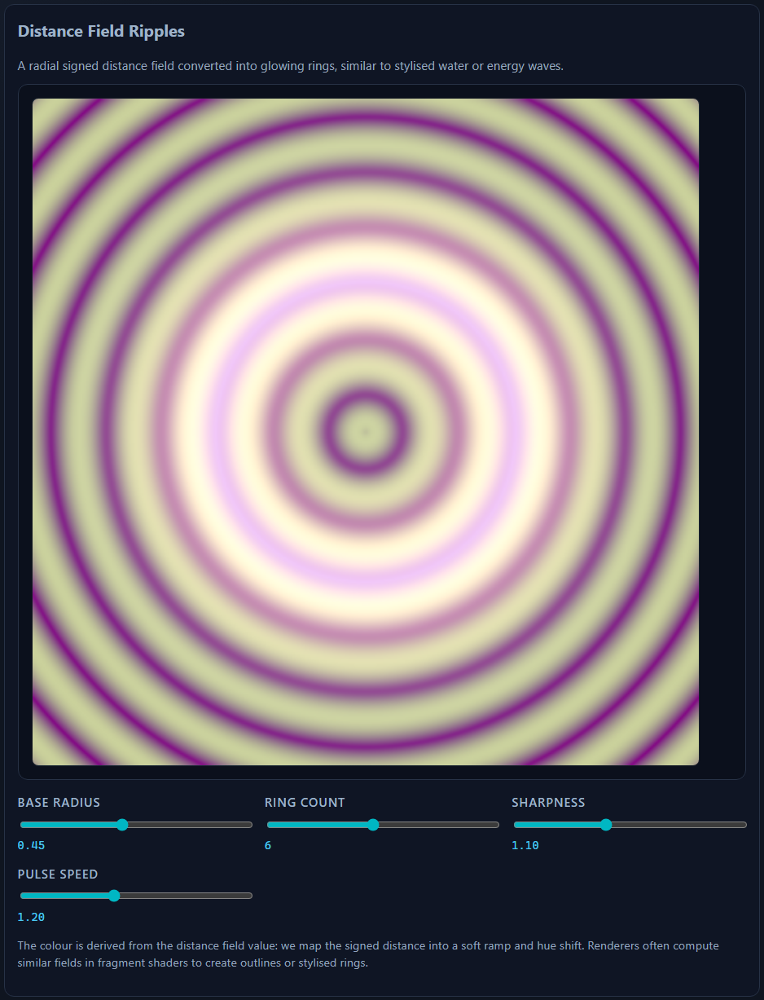

# Shader Book (Checkpoint)

A small multi-page static site for an assignment checkpoint.

## Pages
- `index.html` (home, includes full navigation)
- `about.html`
- `chapters.html`
- `chapter-1.html`
- `chapter-2.html`
- `glossary.html`
- `contact.html`

## Chapters Page (`chapters.php`)

The `chapters.php` page lists the available chapters in the Shader Book and links to their individual pages.

- Uses `header.php` for shared navigation and branding.
- Shows a short intro explaining what the chapters cover.
- Lists each chapter as a link to `chapter-1.php`, `chapter-2.php`, etc.
- Includes a footer that displays the current year via a small JavaScript snippet.

### Screenshots

- 
- 
- 

